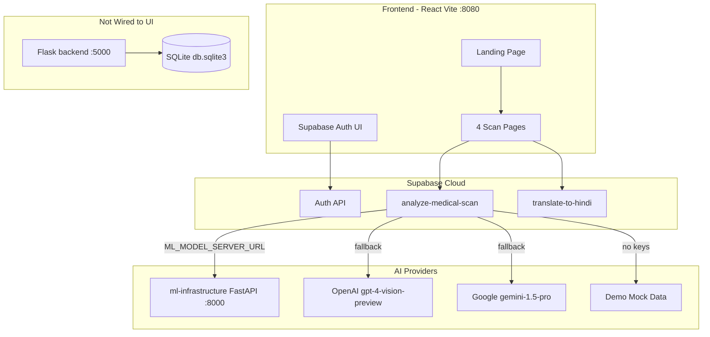

# MedVision-AI — Complete Codebase Analysis Report

**Repository:** [vision-weave-med-main](c:\Users\yrugw\OneDrive\Desktop\vision-weave-med-main)  
**Product:** MedVision AI — AI-powered medical scan analysis (brain, cardiac, chest, bone)  
**Analysis date:** May 31, 2026  
**Scope:** ~142 tracked source files across frontend, Supabase functions, Flask backend, and ML infrastructure

---

## 1. Complete Folder Tree

```
vision-weave-med-main/
├── .env                          # Frontend Supabase keys (gitignored)
├── .gitignore
├── components.json               # shadcn/ui configuration
├── DEPLOYMENT_GUIDE.md
├── eslint.config.js
├── index.html                    # SPA shell
├── LOVABLE_DISCONNECTION_SUMMARY.md
├── package.json / package-lock.json
├── postcss.config.js
├── README.md
├── setup-env.js                  # Scaffolds .env template
├── tailwind.config.ts
├── tsconfig.json / tsconfig.app.json / tsconfig.node.json
├── vite.config.ts                # Dev server port 8080
│
├── public/
│   ├── placeholder.svg
│   └── robots.txt
│
├── src/                          # React SPA (81 files)
│   ├── App.tsx / App.css / main.tsx / index.css / vite-env.d.ts
│   ├── components/
│   │   ├── AIAnalysisStatus.tsx      # ORPHANED
│   │   ├── AuthDialog.tsx
│   │   ├── CallToAction.tsx
│   │   ├── Dashboard.tsx
│   │   ├── DemoSection.tsx
│   │   ├── DiagnosticResults.tsx
│   │   ├── Features.tsx
│   │   ├── Footer.tsx
│   │   ├── Hero.tsx
│   │   ├── HolographicDiagnostics.tsx
│   │   ├── MLModelStatus.tsx         # ORPHANED
│   │   ├── Navigation.tsx
│   │   ├── OrganModel3D.tsx
│   │   ├── RegionalAnalysis.tsx
│   │   ├── ScanTypeSelector.tsx
│   │   ├── ScanUploader.tsx
│   │   └── ui/                       # 49 shadcn/Radix primitives
│   ├── hooks/                        # use-toast.ts, use-mobile.tsx
│   ├── integrations/supabase/        # client.ts, types.ts
│   ├── lib/utils.ts
│   └── pages/                        # Index, 4 scan pages, NotFound
│
├── supabase/
│   ├── config.toml                   # verify_jwt = false on both functions
│   └── functions/
│       ├── analyze-medical-scan/index.ts
│       └── translate-to-hindi/index.ts
│
├── backend/                          # Flask ML API (22 files)
│   ├── .env / requirements.txt / run.py
│   ├── app/
│   │   ├── __init__.py / config.py / extensions.py
│   │   ├── api/                      # diagnostics.py, models.py
│   │   ├── core/                     # model_manager.py, preprocessors.py
│   │   ├── database/models.py        # Scan, AnalysisResult
│   │   ├── models/brain_mri.py
│   │   └── neural_nets/              # densenet, efficientnet, unet
│   └── training/brain/               # train, evaluate, export, inference, visualize
│
└── ml-infrastructure/                # Docker-based training/serving (16 source files)
    ├── Dockerfile / docker-compose.yml / env.example / requirements.txt
    ├── config/                       # base_config.yaml, config.yaml
    ├── monitoring/prometheus.yml
    └── src/
        ├── data/                     # dataset.py, preprocessing.py
        ├── models/medical_models.py
        ├── serving/model_server.py   # FastAPI
        ├── training/trainer.py
        └── utils/                    # callbacks.py, metrics.py
```

**Not present (referenced but missing):** `src/assets/` (hero image), `public/demo-video.mp4`, `supabase/migrations/`, `backend/migrations/`, committed model weight files (`.pth`)

---

## 2. Purpose of Major Folders and Files

| Path | Purpose |
|------|---------|
| [`src/`](src/) | Primary React SPA — landing page, 4 scan workflows, auth UI |
| [`src/pages/`](src/pages/) | Route-level views: home, brain/cardiac/chest/bone scan, 404 |
| [`src/components/`](src/components/) | Feature UI: upload, results, 3D loader, Hindi translation, marketing sections |
| [`src/components/ui/`](src/components/ui/) | shadcn/Radix design system (~49 primitives; most unused) |
| [`src/integrations/supabase/`](src/integrations/supabase/) | Supabase client + generated types (empty DB schema) |
| [`supabase/functions/`](supabase/functions/) | Deno edge functions — production analysis/translation path |
| [`backend/`](backend/) | Standalone Flask API with SQLite persistence + PyTorch inference |
| [`backend/training/brain/`](backend/training/brain/) | Offline brain MRI training/evaluation pipeline |
| [`ml-infrastructure/`](ml-infrastructure/) | FastAPI model server, training stack, Docker Compose (Redis, MLflow, Prometheus, Grafana) |
| [`public/`](public/) | Static assets served by Vite |
| Root configs | Vite, TypeScript, Tailwind, ESLint, shadcn setup |

---

## 3. Architecture Overview



**Key insight:** The shipped product path is **React → Supabase Edge Functions → (optional FastAPI | OpenAI | Gemini | demo)**. The Flask backend is a complete parallel stack with no frontend references.

---

## 4. Frontend Analysis

### Tech Stack
- React 18 + TypeScript + Vite 5
- React Router 6, TanStack Query 5 (provider only — no queries used)
- Tailwind CSS 3 + shadcn/ui + Radix UI
- Three.js / React Three Fiber (decorative sphere only)
- Framer Motion, Recharts, react-hook-form + zod
- Supabase JS client for auth + edge function invocation

### Routes

| Route | Component | Status |
|-------|-----------|--------|
| `/` | [`Index.tsx`](src/pages/Index.tsx) | Complete (marketing) |
| `/brain-scan` | [`BrainScan.tsx`](src/pages/BrainScan.tsx) | Complete (minor bug) |
| `/cardiac-scan` | [`CardiacScan.tsx`](src/pages/CardiacScan.tsx) | Complete (minor bug) |
| `/chest-scan` | [`ChestScan.tsx`](src/pages/ChestScan.tsx) | Complete (minor bug) |
| `/bone-scan` | [`BoneScan.tsx`](src/pages/BoneScan.tsx) | Complete (minor bug) |
| `*` | [`NotFound.tsx`](src/pages/NotFound.tsx) | Complete (minimal) |

### Implemented Features
- Landing page with hero, stats, scan type selector, features, holographic section, demo section, CTA, footer
- Four scan upload workflows with drag-and-drop, client-side validation (type, size, filename heuristics)
- AI analysis via Supabase `analyze-medical-scan` edge function
- Results display with findings, severity, confidence, static recommendations
- Hindi translation + browser TTS via `translate-to-hindi` edge function
- Supabase email/password auth (sign in, sign up, sign out, session persistence)
- Toast notifications, responsive navigation, mobile menu
- Decorative 3D loading animation during analysis

### Partially Implemented Features
- **Auth-gated analysis history** — promised in [`AuthDialog.tsx`](src/components/AuthDialog.tsx) copy; no DB tables, no UI
- **Dashboard stats** — hardcoded numbers in [`Dashboard.tsx`](src/components/Dashboard.tsx)
- **Demo video** — [`DemoSection.tsx`](src/components/DemoSection.tsx) references `/demo-video.mp4` (missing)
- **Hero image** — [`Hero.tsx`](src/components/Hero.tsx) imports `@/assets/hero-medical-brain.jpg` (missing)
- **Navigation scroll anchors** — `#features`, `#technology` IDs missing on target sections
- **DICOM support** — accepted in file input but not parsed (heuristic validation only)
- **3D organ models** — marketing claims WebXR/haptics; runtime is a generic rotating sphere
- **ML model status dashboard** — [`MLModelStatus.tsx`](src/components/MLModelStatus.tsx) built but never mounted; uses wrong env prefix (`REACT_APP_` vs Vite `VITE_`)
- **React Query** — provider configured in [`App.tsx`](src/App.tsx) but zero `useQuery`/`useMutation` usage
- **Analysis state bug** — on success, `setIsAnalyzing(false)` is never called in scan pages; analyzing UI can overlap results:

```68:82:src/pages/BrainScan.tsx
  const handleFileSelect = async (file: File) => {
    setIsAnalyzing(true);
    try {
      const results = await analyzeScan(file, "Brain");
      setAnalysisResults(results);
      // BUG: setIsAnalyzing(false) missing on success path
    } catch (error) {
      ...
      setIsAnalyzing(false);
    }
  };
```

### Missing Frontend Features
- Scan history / user dashboard (per-user persisted results)
- Protected routes (auth does not gate scan analysis)
- Real organ-specific 3D models
- PDF/export of reports
- Admin panel
- Real-time scan progress (streaming)
- Proper DICOM viewer
- Shared `useAnalyzeScan` hook (logic duplicated 4× across scan pages)
- Footer/legal links (all `href="#"` stubs)
- Integration with Flask `/api/v1` backend

---

## 5. Backend Analysis

The project has **three backend layers**:

### A. Supabase Edge Functions (Production Path)

| Function | File | Purpose |
|----------|------|---------|
| `analyze-medical-scan` | [`supabase/functions/analyze-medical-scan/index.ts`](supabase/functions/analyze-medical-scan/index.ts) | Multi-tier analysis: FastAPI ML server → OpenAI → Gemini → demo |
| `translate-to-hindi` | [`supabase/functions/translate-to-hindi/index.ts`](supabase/functions/translate-to-hindi/index.ts) | Hindi translation: OpenAI → Gemini → demo suffix |

Both have `verify_jwt = false` — callable without authentication.

### B. Flask Backend (Standalone, Not Wired to UI)

| Component | File | Status |
|-----------|------|--------|
| App factory | [`backend/app/__init__.py`](backend/app/__init__.py) | Complete |
| ModelManager | [`backend/app/core/model_manager.py`](backend/app/core/model_manager.py) | Complete with simulation fallback |
| Preprocessors | [`backend/app/core/preprocessors.py`](backend/app/core/preprocessors.py) | Complete (DICOM/NIfTI/images) |
| Brain MRI + Grad-CAM | [`backend/app/models/brain_mri.py`](backend/app/models/brain_mri.py) | Complete architecture |
| Neural nets | [`backend/app/neural_nets/`](backend/app/neural_nets/) | EfficientNet, DenseNet, U-Net |
| Training pipeline | [`backend/training/brain/`](backend/training/brain/) | Complete offline tooling |
| SQLite persistence | [`backend/app/database/models.py`](backend/app/database/models.py) | Complete (Scan + AnalysisResult) |

**Gaps:** No auth middleware, simulation mode when weights missing, simulated XAI overlays for non-brain scans, cardiac postprocessing likely incorrect for U-Net segmentation, no frontend integration.

### C. ML Infrastructure (FastAPI, Optional)

| Component | File | Status |
|-----------|------|--------|
| FastAPI server | [`ml-infrastructure/src/serving/model_server.py`](ml-infrastructure/src/serving/model_server.py) | Complete |
| Model definitions | [`ml-infrastructure/src/models/medical_models.py`](ml-infrastructure/src/models/medical_models.py) | Complete (EfficientNet-B4, ResNet50, DenseNet121) |
| Training | [`ml-infrastructure/src/training/trainer.py`](ml-infrastructure/src/training/trainer.py) | Complete (wandb, MLflow) |
| Docker Compose | [`ml-infrastructure/docker-compose.yml`](ml-infrastructure/docker-compose.yml) | ML server, Redis, MLflow, Prometheus, Grafana |

**Gaps:** Requires `{scan_type}_best_model.pth` weight files; class taxonomy differs from Flask brain labels.

---

## 6. All API Endpoints

### Flask REST API — Base: `/api/v1` (port 5000)

| Method | Path | Purpose |
|--------|------|---------|
| GET | `/api/v1/health` | GPU/CPU status, loaded model keys |
| GET | `/api/v1/models` | Metadata for 4 models (loaded state, classes) |
| POST | `/api/v1/predict/brain` | Brain MRI upload → EfficientNet-B0 + Grad-CAM |
| POST | `/api/v1/predict/<scan_type>` | Generic predict for `bone`, `chest`, `cardiac` |
| GET | `/api/v1/history` | List all scans with confidence |
| GET | `/api/v1/history/<scan_id>` | Full analysis for one scan |
| GET | `/api/v1/media/<folder>/<filename>` | Static files from `uploads` or `results` |

### Supabase Edge Functions (invoked via `supabase.functions.invoke`)

| Function | Body | Response |
|----------|------|----------|
| `analyze-medical-scan` | `{ imageData, scanType }` | `{ findings[], overallConfidence, scanType, isValidMedicalScan, modelType?, processingTime? }` |
| `translate-to-hindi` | `{ text }` | `{ translatedText }` |

### FastAPI ML Server — Base: port 8000

| Method | Path | Purpose |
|--------|------|---------|
| GET | `/` | API info, available models |
| GET | `/health` | Health + loaded model count |
| GET | `/models/status` | Per-scan-type model status |
| POST | `/predict` | JSON: `{ image_data, scan_type, confidence_threshold }` |
| POST | `/predict/file` | Multipart: `file`, `scan_type`, `confidence_threshold` |

### Supabase Auth (client-side, not REST endpoints owned by this repo)
- `signInWithPassword`, `signUp`, `signOut`, `onAuthStateChange`, `getSession`

---

## 7. All Database Models

### Flask SQLAlchemy (SQLite) — [`backend/app/database/models.py`](backend/app/database/models.py)

| Table | Model | Key Fields |
|-------|-------|------------|
| `scans` | `Scan` | `id`, `filename`, `scan_type` (brain/bone/chest/cardiac), `upload_time` |
| `analysis_results` | `AnalysisResult` | `id`, `scan_id` (FK), `prediction` (JSON text), `confidence`, `processing_time`, `model_used`, `result_image`, `created_at` |

Relationship: Scan 1:1 AnalysisResult (cascade delete).

### Supabase Postgres — [`src/integrations/supabase/types.ts`](src/integrations/supabase/types.ts)

```typescript
Tables: { [_ in never]: never }  // EMPTY — no application tables defined
```

Supabase is used for Auth and Edge Functions only; no scan persistence in cloud DB.

---

## 8. All AI Models Integrated

### Cloud LLM APIs (via Supabase Edge Functions)

| Provider | Model | Used For | Env Key |
|----------|-------|----------|---------|
| OpenAI | `gpt-4-vision-preview` | Medical scan image analysis | `OPENAI_API_KEY` |
| OpenAI | `gpt-4` | Hindi text translation | `OPENAI_API_KEY` |
| Google | `gemini-1.5-pro` | Scan analysis + translation (fallback) | `GEMINI_API_KEY` |
| Demo | N/A | Mock findings when no keys/server | — |

### Flask Backend PyTorch Models — [`backend/app/core/model_manager.py`](backend/app/core/model_manager.py)

| Scan Type | Architecture | Weights Path | XAI |
|-----------|-------------|--------------|-----|
| Brain | EfficientNet-B0 + Grad-CAM | `storage/models/brain/v1.0.0/brain_model.pth` | Grad-CAM heatmaps |
| Bone | EfficientNet-B0 | `storage/models/bone/bone_best.pth` | Simulated OpenCV overlay |
| Chest | DenseNet-121 | `storage/models/chest/chest_best.pth` | Simulated OpenCV overlay |
| Cardiac | U-Net | `storage/models/cardiac/cardiac_best.pth` | Simulated OpenCV overlay |

Falls back to **simulation mode** (fixed demo labels) when weights are missing.

### ML Infrastructure FastAPI Models — [`ml-infrastructure/src/models/medical_models.py`](ml-infrastructure/src/models/medical_models.py)

| Scan Type | Architecture | Weights Path |
|-----------|-------------|--------------|
| Brain | EfficientNet-B4 (timm) | `models/brain/brain_best_model.pth` |
| Chest | DenseNet-121 (torchvision) | `models/chest/chest_best_model.pth` |
| Cardiac | ResNet50 (torchvision) | `models/cardiac/cardiac_best_model.pth` |
| Bone | EfficientNet-B4 (timm) | `models/bone/bone_best_model.pth` |

### Not Integrated
Anthropic/Claude, Hugging Face, Ollama, Replicate, local LLMs — none found in codebase.

---

## 9. Dead Code, Duplicate Code, and Unused Files

### Dead / Orphaned Files (never imported)

| File | Issue |
|------|-------|
| [`src/components/AIAnalysisStatus.tsx`](src/components/AIAnalysisStatus.tsx) | Built but never mounted; displays wrong model name ("Gemini 2.5 Flash") |
| [`src/components/MLModelStatus.tsx`](src/components/MLModelStatus.tsx) | Built but never mounted; uses `REACT_APP_ML_SERVER_URL` (CRA prefix, not Vite) |
| [`src/App.css`](src/App.css) | Never imported (only `index.css` used) |
| [`src/components/ui/use-toast.ts`](src/components/ui/use-toast.ts) | Duplicate shim; app uses `@/hooks/use-toast` |
| [`src/hooks/use-mobile.tsx`](src/hooks/use-mobile.tsx) | Only used by unused `sidebar.tsx` |

### Unused shadcn UI Primitives (~30 of 49)
Only used: button, card, progress, badge, dialog, input, label, dropdown-menu, toast, toaster, sonner, tooltip. The rest (accordion, calendar, chart, form, sidebar, table, tabs, etc.) are shipped stubs with no app references.

### Duplicate Code

| Duplication | Files | Impact |
|-------------|-------|--------|
| Scan page logic (4×) | `BrainScan.tsx`, `ChestScan.tsx`, `CardiacScan.tsx`, `BoneScan.tsx` | ~60 lines identical per file (`analyzeScan`, handlers, layout) |
| OpenAI/Gemini client logic (2×) | `analyze-medical-scan/index.ts`, `translate-to-hindi/index.ts` | Same key-check → OpenAI → Gemini → demo pattern |
| BrainMRIClassifier (2×) | `backend/app/models/brain_mri.py` vs `backend/app/neural_nets/efficientnet.py` | Training uses one; serving uses another — architecture drift risk |
| Triple ML stacks | Supabase+LLM, Flask, FastAPI | Overlapping model registries, different class taxonomies, different API paths |

### Entire Backend Unused by Frontend
The complete [`backend/`](backend/) Flask API (~22 files) has zero references from `src/`.

---

## 10. Development Status Report

### Completed Modules

| Module | Layer | Notes |
|--------|-------|-------|
| Landing page & marketing UI | Frontend | Fully styled, animated |
| Scan upload + validation | Frontend | Client-side heuristics |
| 4 scan type workflows | Frontend | End-to-end via Supabase |
| AI analysis (cloud path) | Edge Functions | Multi-tier fallback chain |
| Hindi translation + TTS | Frontend + Edge | Working with fallbacks |
| Supabase auth UI | Frontend | Sign in/up/out |
| Diagnostic results display | Frontend | Findings, confidence, severity |
| Flask REST API | Backend | 7 endpoints, SQLite, ML pipeline |
| Flask training pipeline | Backend | Brain MRI train/eval/export |
| FastAPI model server | ML Infra | 5 endpoints, Docker Compose |
| ML training infrastructure | ML Infra | Trainer, data pipeline, monitoring |
| Demo mode | Edge Functions | Works without any API keys |

### In-Progress Modules

| Module | Layer | Gap |
|--------|-------|-----|
| Custom ML model integration | Edge → FastAPI | Wired in edge function but weights missing; frontend status UI orphaned |
| Flask ML inference | Backend | Simulation fallback active; real weights not in repo |
| Auth + persistence | Full stack | Auth works; no user-scoped scan history anywhere |
| 3D visualization | Frontend | Decorative sphere only; marketing promises more |
| DICOM support | Frontend + Backend | Accepted but not truly parsed |
| React Query data layer | Frontend | Provider configured, zero usage |
| XAI / heatmap overlays | Backend | Brain has Grad-CAM; others use simulated OpenCV |
| Cardiac segmentation | Backend | U-Net postprocessing likely incorrect |

### Missing Modules

| Module | Priority | Description |
|--------|----------|-------------|
| Scan history / user dashboard | High | Promised in auth copy; no DB schema or UI |
| Frontend ↔ Flask integration | High | Two complete stacks, zero connection |
| Unified ML backend | High | Three parallel stacks with conflicting APIs/taxonomies |
| Protected routes / auth gating | Medium | Analysis callable without login |
| Real model weights | High | No `.pth` files committed; all paths simulate |
| DICOM viewer/parser | Medium | Marketing claim, not implemented |
| PDF report export | Low | Not started |
| Admin panel | Low | Not started |
| Supabase DB migrations | Medium | Empty schema; no cloud persistence |
| Test suite | High | No unit, integration, or E2E tests found |
| CI/CD pipeline | Medium | No GitHub Actions or similar |
| HIPAA compliance | Low | Marketing claim only |

---

## 11. Top 10 Highest-Priority Tasks (Recommended Order)

1. **Fix `isAnalyzing` state bug on all 4 scan pages** — Add `setIsAnalyzing(false)` on success path; prevents analyzing UI overlapping results. Small fix, immediate UX impact.

2. **Extract shared `useAnalyzeScan` hook** — Eliminate 4× duplicated scan page logic (~240 lines → ~60 lines + 1 hook). Reduces maintenance burden and ensures consistent behavior.

3. **Choose and unify the ML backend** — Pick one canonical stack (recommend: FastAPI `ml-infrastructure` since edge function already calls it). Deprecate or bridge Flask endpoints. Align class taxonomies across stacks.

4. **Implement scan history with Supabase Postgres** — Add `scans` and `analysis_results` tables to Supabase, generate types, build history UI gated by auth. Fulfills promise in AuthDialog copy.

5. **Train and deploy real model weights** — Without `.pth` files, all custom ML paths return simulation/demo data. Use existing training pipelines in `backend/training/brain/` and `ml-infrastructure/src/training/`.

6. **Wire or remove orphaned components** — Either mount `MLModelStatus` with correct `VITE_ML_SERVER_URL` env, or delete `MLModelStatus.tsx`, `AIAnalysisStatus.tsx`, and `App.css`. Clean up ~30 unused shadcn primitives if bundle size matters.

7. **Enable JWT verification on edge functions** — Set `verify_jwt = true` in [`supabase/config.toml`](supabase/config.toml) and require auth for analysis calls. Prevents unauthenticated API abuse.

8. **Fix missing assets and broken navigation** — Add hero image to `src/assets/`, demo video to `public/`, add `id="features"` and `id="technology"` to target sections, fix footer stub links.

9. **Consolidate duplicate BrainMRIClassifier** — Align `backend/app/models/brain_mri.py` (serving) with `backend/app/neural_nets/efficientnet.py` (training) to prevent architecture drift when loading trained weights.

10. **Add test suite and CI pipeline** — No tests exist. Start with: edge function unit tests, Flask API integration tests, frontend component tests for scan workflow, GitHub Actions for lint + build + test on PR.

---

## 12. Summary

MedVision-AI is a **functional prototype** with a polished marketing frontend and a working cloud analysis path (Supabase Edge Functions → OpenAI/Gemini/demo). The product demo works end-to-end for scan upload and AI results display.

However, the codebase carries significant **architectural debt**: three parallel ML backends (none fully production-ready), no cloud persistence, no test coverage, auth that doesn't gate features, and substantial dead/duplicate code. The Flask backend is a complete alternative stack that the React app never calls. Custom PyTorch models exist as architectures and training scripts but lack deployed weights, causing all local ML paths to fall back to simulation.

The highest-impact next steps are fixing the analysis state bug, consolidating the ML stack, adding real persistence, and deploying trained model weights.
