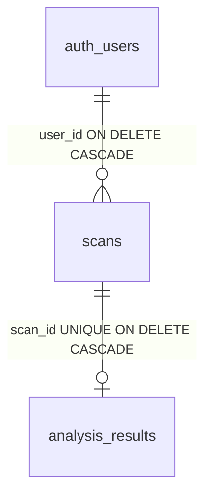

# Supabase Persistence Review

Read-only review of [`20260531153000_medvision_scans_persistence.sql`](supabase/migrations/20260531153000_medvision_scans_persistence.sql), [`20260531153100_medvision_storage_buckets.sql`](supabase/migrations/20260531153100_medvision_storage_buckets.sql), and [`src/integrations/supabase/types.ts`](src/integrations/supabase/types.ts). Supabase CLI was not available locally, so SQL was reviewed statically against PostgreSQL 15 / Supabase conventions (not executed against a live project).

---

## Executive summary

| Area | Verdict |
|------|---------|
| SQL syntax & structure | **Valid** on Supabase PG15 |
| Foreign keys | **Correct**; cascade behavior is sound |
| Table RLS | **Sound** for owner-only access |
| Storage policies | **Mostly sound**; idempotency and default-policy interaction are risks |
| `scan_history` view | **Correct** with `security_invoker` |
| TypeScript types | **Aligned** with schema; a few runtime/type looseness gaps |
| Overall deploy risk | **Low–medium** (storage migration re-runs, MIME paths, service-role writes) |

---

## 1. SQL migration validity

### `20260531153000_medvision_scans_persistence.sql`

**Valid constructs**

- `create extension if not exists pgcrypto` — safe; `gen_random_uuid()` also exists in core PG13+.
- Enums `scan_status`, `pdf_export_status` — valid.
- Tables, checks, indexes, triggers — syntactically valid for PG15.
- `execute function public.set_updated_at()` — valid on Supabase (PG14+ trigger syntax).
- `create view ... with (security_invoker = true)` — requires PG15+ (Supabase default).

**Idempotency (first migration)**

| Statement | Re-run behavior |
|-----------|-----------------|
| `create type` | **Fails** if types already exist |
| `create table` | **Fails** if tables exist |
| `create policy` | **Fails** if policy names exist |
| `create or replace view` | **OK** |
| `create or replace function` | **OK** |

Expected for a one-shot migration; not safe to re-apply blindly on a partially migrated DB.

**Minor notes**

- `analysis_results_scan_id_idx` is redundant with `UNIQUE (scan_id)` (harmless).
- `set_updated_at()` in `public` is a generic name; could collide in large multi-app DBs (low risk here).

### `20260531153100_medvision_storage_buckets.sql`

**Valid constructs**

- `insert into storage.buckets (...)` — matches Supabase `storage.buckets` columns (`id`, `name`, `public`, `file_size_limit`, `allowed_mime_types`).
- `on conflict (id) do nothing` — idempotent for bucket creation.
- `storage.foldername(name)` — standard Supabase helper for path-based RLS.

**Idempotency (second migration)**

| Statement | Re-run behavior |
|-----------|-----------------|
| Bucket `insert` | **OK** (`on conflict do nothing`) |
| `create policy` on `storage.objects` | **Fails** if same policy names already exist |

---

## 2. Foreign keys



| FK | Definition | Assessment |
|----|------------|------------|
| `scans.user_id` → `auth.users(id)` | `ON DELETE CASCADE` | Correct: deleting auth user removes scans. |
| `analysis_results.scan_id` → `scans(id)` | `UNIQUE`, `ON DELETE CASCADE` | Correct: enforces 1:1; deleting scan removes analysis. |

**Not modeled (by design)**

- No FK from `scans.storage_path` / `analysis_results.pdf_storage_path` to `storage.objects` — paths are conventions only; orphans possible if DB row deleted without storage cleanup.
- No FK from `analysis_results` to `auth.users` — ownership is enforced via `scans` + RLS (acceptable).

**Insert ordering**

1. Insert `scans` (with `user_id = auth.uid()`).
2. Insert `analysis_results` (`scan_id` must reference existing scan).

RLS `EXISTS (... scans.user_id = auth.uid())` matches this order.

---

## 3. RLS policies (tables)

RLS is enabled on both tables. Policies target `authenticated` only (no `anon` policies → unauthenticated clients denied).

### `scans`

| Policy | Operation | Rule | Assessment |
|--------|-----------|------|------------|
| `scans_select_own` | SELECT | `auth.uid() = user_id` | OK |
| `scans_insert_own` | INSERT | `with check (auth.uid() = user_id)` | OK — blocks assigning another user’s id |
| `scans_update_own` | UPDATE | `using` + `with check` both `auth.uid() = user_id` | OK — blocks transferring row to another user |
| `scans_delete_own` | DELETE | `auth.uid() = user_id` | OK |

### `analysis_results`

| Policy | Operation | Rule | Assessment |
|--------|-----------|------|------------|
| `*_select_own` | SELECT | Parent scan owned by `auth.uid()` | OK |
| `*_insert_own` | INSERT | Parent scan owned by `auth.uid()` | OK |
| `*_update_own` | UPDATE | `using` + `with check` via parent scan | OK |
| `*_delete_own` | DELETE | Parent scan owned | OK |

**Gaps / edge cases (not bugs in SQL, but operational)**

| Issue | Impact |
|-------|--------|
| **`service_role` bypasses RLS** | Edge functions or backend using service key can read/write all rows unless app code enforces `user_id`. |
| **No `anon` policies** | Matches “authenticated user only”; current scan flow works without login but won’t persist until user signs in. |
| **No trigger enforcing `analysis_results.scan_type = scans.scan_type`** | App can store mismatched `scan_type` on analysis vs scan. |
| **`findings` / `report_snapshot` not validated beyond JSON array** | Invalid finding shapes can be stored; DB won’t enforce `severity` enum. |

---

## 4. Storage policies

### Bucket configuration

| Bucket | Private | Size limit | MIME allowlist |
|--------|---------|------------|----------------|
| `medical-scans` | yes | 50 MiB | png, jpeg, jpg, dicom, octet-stream |
| `medical-reports` | yes | 10 MiB | pdf |

Aligns with [`STORAGE_BUCKETS`](src/integrations/supabase/types.ts) and `storagePaths` (`{userId}/{scanId}/...`).

### Object policies

All eight policies require:

```sql
bucket_id = '...' AND (storage.foldername(name))[1] = auth.uid()::text
```

**Correct** if clients upload to `{uuid}/{scanId}/filename` (matches `storagePaths.scanOriginal`).

### Storage edge cases & failure modes

| Risk | Severity | Detail |
|------|----------|--------|
| **Existing permissive `storage.objects` policies** | High (if present) | RLS policies are OR’d. Old “allow all authenticated” policies would still permit broader access alongside these. Audit Dashboard → Storage → Policies before/after migrate. |
| **Policy name collision on re-run** | Medium | Second `CREATE POLICY` fails if names exist. |
| **MIME mismatch for DICOM / NIfTI** | Medium | Many clients send `application/octet-stream` (allowed) or types not in list → upload rejected at bucket level. `.nii` / `.gz` often not in allowlist. |
| **`image/jpg` non-standard** | Low | Harmless extra; real type is usually `image/jpeg`. |
| **Path must include user folder** | Medium | Object at bucket root (`name` without `/`) → `foldername[1]` may not equal `auth.uid()` → upload denied (usually desired). |
| **UUID string case** | Low | Paths must use same UUID formatting as `auth.uid()::text` (lowercase). |
| **No link DB ↔ storage** | Medium | User can upload storage objects without a `scans` row (orphan files). |
| **Service role PDF upload** | Medium (future) | Server-side PDF generation with service role bypasses storage RLS unless using user JWT or scoped signed upload. |

---

## 5. `scan_history` view

```sql
create or replace view public.scan_history
with (security_invoker = true)
as
select ... from scans s
left join analysis_results ar on ar.scan_id = s.id;
```

| Check | Result |
|-------|--------|
| `security_invoker = true` | RLS on `scans` and `analysis_results` applies to caller — **correct** for per-user history. |
| `LEFT JOIN` | Scans without analysis appear with null analysis columns — **good** for in-progress/failed flows. |
| `GRANT SELECT ... TO authenticated` | View queryable via PostgREST — **OK**. |
| No `INSERT`/`UPDATE` on view | Read-only history — **OK**. |

**Query behavior**

- Listing via `.from("scan_history").order("uploaded_at", { ascending: false })` returns only the current user’s rows (via underlying RLS).
- **Not included in view:** `findings`, `hindi_translation`, `report_snapshot` — detail/PDF flows need a separate query on `analysis_results` (intentional for list UI).

**Edge case:** Without `WHERE status = 'completed'`, pending/analyzing/failed scans appear in history (usually desirable).

---

## 6. TypeScript types vs schema

### Tables — column alignment

| SQL column | TS `Row` type | Match |
|------------|---------------|-------|
| `scans.*` | `Tables<"scans">` | Yes |
| `analysis_results.*` | `Tables<"analysis_results">` | Yes |
| Enums | `scan_status`, `pdf_export_status` | Yes |

### View — column alignment

| View column | `ScanHistoryRow` | Match |
|-------------|------------------|-------|
| All 17 selected columns | `Views.scan_history.Row` | Yes |

### Frontend conventions

| Frontend (`useAnalyzeScan`) | Persistence | Notes |
|----------------------------|-------------|-------|
| `ScanFinding` | `findings` jsonb + `DbScanFinding` | Structural match; **DB does not enforce** |
| `AnalysisResults` | `report_snapshot` + denormalized columns | Match if app writes both |
| `overallConfidence` (0–100) | `overall_confidence` integer + check | Match |
| `processingTime` (seconds, number) | `processing_time_ms` | **App must convert** (`× 1000`); types don’t document this |
| `scanType` strings | `scan_type` check constraint | Match (`Brain`, `Chest/Lungs`, etc.) |

### Type looseness (runtime, not schema errors)

| Item | Issue |
|------|--------|
| `findings: DbScanFinding[]` | PostgREST returns jsonb; TypeScript won’t catch malformed JSON at compile time. |
| `report_snapshot: DbAnalysisReportSnapshot` | SQL default `'{}'` is not a valid snapshot shape until app writes real data. |
| `file_size_bytes: number \| null` | Bigint may arrive as **string** from PostgREST for large values — possible runtime mismatch. |
| `scans.Relationships: []` | Omits FK to `auth.users` (normal for Supabase-generated types). |
| Manual types vs CLI | After `supabase gen types`, convenience exports at bottom may be overwritten. |

---

## 7. Migration failures & edge cases (checklist)

### Likely to fail on apply

1. **Re-running migrations** on non-empty DB (duplicate types/tables/policies).
2. **Storage policies** if policy names already exist.
3. **Local Postgres without `auth` schema** — `references auth.users` fails outside Supabase.
4. **PG &lt; 15** — `security_invoker` on views unsupported (not an issue on current Supabase).

### Likely to fail at runtime (after successful migrate)

1. **Unauthenticated users** — no RLS path; persistence requires sign-in.
2. **Storage upload MIME** — DICOM/NIfTI/browser-specific types blocked by `allowed_mime_types`.
3. **Wrong storage path** — not `{user_id}/...` → RLS denial.
4. **Insert `analysis_results` before `scans`** — FK violation.
5. **Second `analysis_results` for same `scan_id`** — unique violation.
6. **Edge function persistence with service role** — must set/check `user_id` in code (RLS bypass).
7. **Coexisting open storage policies** — ineffective restriction if old policies remain.

### Design gaps for later implementation

| Gap | Recommendation (when implementing UI) |
|-----|----------------------------------------|
| Orphan storage objects | Delete storage on scan delete or periodic cleanup |
| `scan_type` drift | Single source from `scans` or DB trigger |
| History without findings | Detail query: `analysis_results` by `scan_id` |
| PDF pipeline | Update `pdf_status`, `pdf_storage_path`, `pdf_generated_at` atomically |
| Anonymous scan-then-login | Optional migration: attach `user_id` on first auth (not in schema today) |

---

## 8. Verdict by task

| # | Task | Result |
|---|------|--------|
| 1 | SQL migrations valid | **Pass** (Supabase PG15); not idempotent on re-run |
| 2 | Foreign keys | **Pass** |
| 3 | RLS policies | **Pass** for authenticated owner model; note `service_role` bypass |
| 4 | Storage policies | **Pass** with caveats (MIME, path shape, existing policies, re-run) |
| 5 | `scan_history` view | **Pass** |
| 6 | TypeScript vs schema | **Pass** with jsonb/bigint/runtime caveats |
| 7 | Failures / edge cases | **Documented above** |

No code changes were made. Before production apply, run `supabase db push` (or SQL Editor) on a staging project and confirm Storage policies in the dashboard do not include broader legacy rules that would override the intended folder-scoped model.